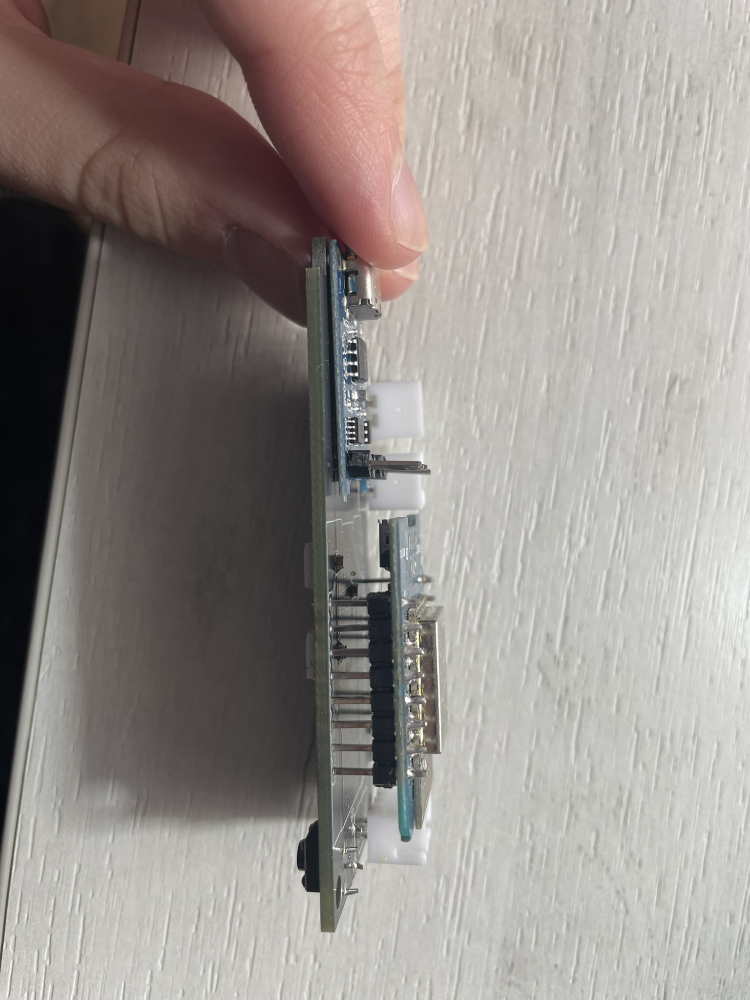
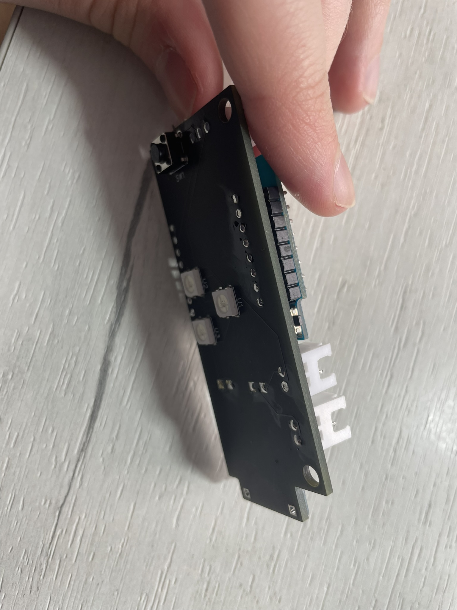
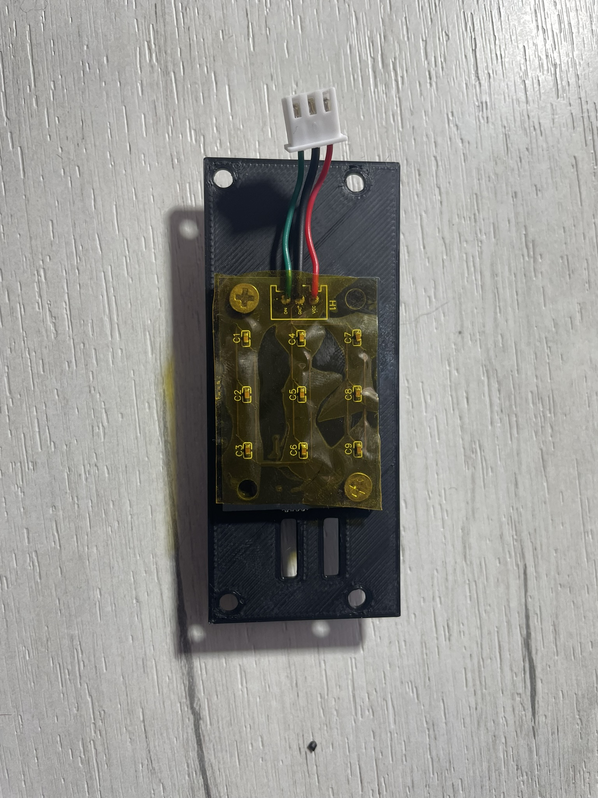
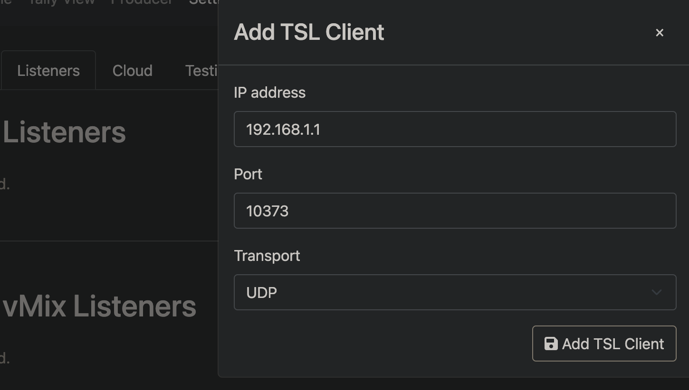
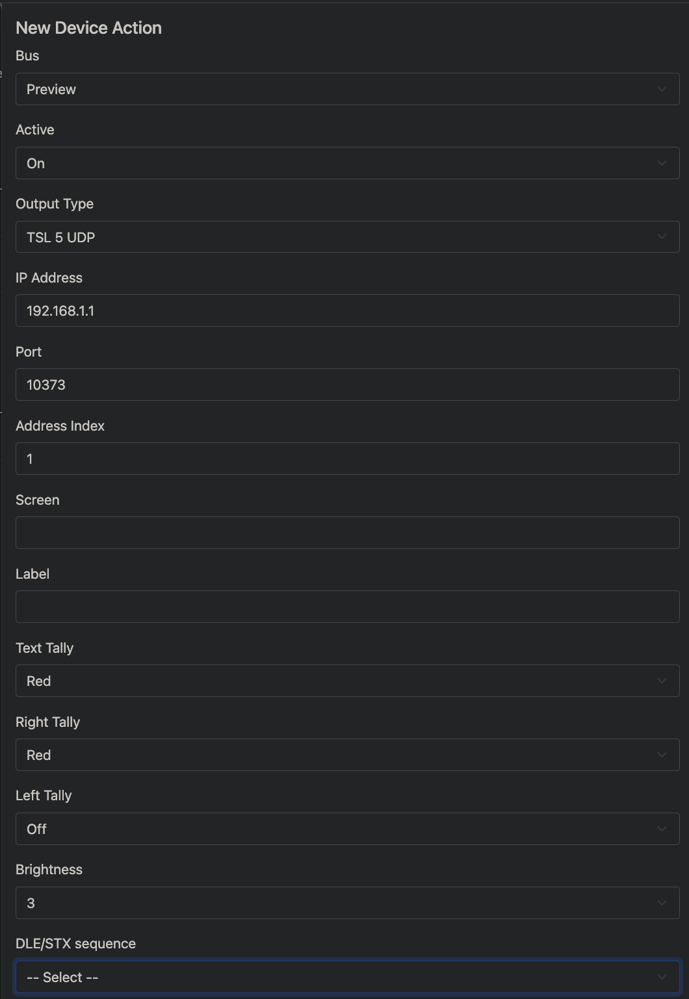

# Tally Lights by Michal Ramus

## Table of contents

* [General info](#general-info)
* [Features](#features)
* [Parts list](#parts-list)
* [How to assemble](#how-to-assemble)
* [Installation](#installation)
* [Configuration](#configuration)
* [TallyArbiter configuration](#tallyarbiter-configuration)
* [WiFi reconfiguration](#wifi-reconfiguration)
* [Led status](#led-status)
* [OTA update](#ota-update)
* [TODO](#todo)

## General info

Cheap tally lights which support [TSL 3.1 and 5.0 protocol.](tsl-umd-protocol.pdf) Software can be replaced by any other which works on WeMos D1 Mini. For example [vTally.](https://github.com/wifi-tally/wifi-tally)

## Features

* Based on WeMos D1 Mini
* Compatible with [TallyArbiter](https://github.com/josephdadams/TallyArbiter)
* Overall cost is about 35 EUR
* Support TSL 3.1 and 5.0 protocol
* Powered by 18650 battery
* WiFi connection
* Easy to modify

## Parts list

| Part | Quantity |
| :--- | :------: |
| WeMos D1 mini | 1 |
| TP4056 charging module | 1 |
| 18650 battery | 1 |
| 18650 battery holder | 1 |
| 5050WS2812B LED | 12 |
| 2 position switch SS12F15 | 1 |
| 0.1 uF capacitor | 12 |
| R0603 10k resistor | 1 |
| R0603 20k resistor | 1 |
| tactile button 6x6x6mm | 1 |
| JST-XH-2Pin connector | 1 |
| JST-XH-3Pin connector | 2 |
| M2x3mm screw | 1 |
| M3x4mm screw | 2 |
| M3x6mm screw | 7 |
| 3D printed parts |
| PCB|
| Some wires |

## How to assemble

### Pinout

| Pin | Description |
| :---| :---------- |
| A0 | Battery voltage |
| D1 | WS2812B Leds (first connected back leds) |
| D2 | Button (needs to be pulled up) |

### Assembly

> ***Before soldering [flash firmware](#installation) into WeMos D1 mini.*** After soldering, it will be hard because of usb port location.

1. Solder all SMD components
2. Solder all THT components
    > **Important:** From the bottom side of PCB, none of the pins should be extended. This side should be as flat as possible.
    >
    > Leave space between WeMos D1 mini and PCB. Solder TP4056 as close as possible to PCB.
    >
    > Don't solder JST-XH connector on the led matrix.

    
    

3. Solder wires directly to the led matrix (length around 4 cm)
4. Screw Led matrix to the cover using M3x4mm screws (Led matrix is symmetrical, check if you are screwing it in the right direction)

    

5. Solder wires to switch (length around 8 cm)
6. Screw main board to the main case by M3x6mm screws
7. Glue 18650 battery holder to the bottom part
    * If you are going to use longer battery(e.g. EverActive 18650 which is 69mm long), you can cut in half the battery holder and glue it maximally to the sides.

    

8. Screw switch to the cover using M2x3mm screw
9. Crimp all JST-XH plug connectors to the wires (check polarity)
10. Connect all wires to the main board
11. Screw cover to the main board using M3x6mm screws
12. Glue casings

## Installation

Download Visual Studio Code and install PlatformIO extension. Open project and compile it. Connect WeMos D1 Mini to PC and upload firmware.

After first boot, device will create WiFi network with name `TallyLight-MAR-<MacAddress>`. Connect to it and type `192.168.4.1` in browser. You will see configuration page. Enter SSID and password of your WiFi network and click `Save`. Device will reboot and connect to your WiFi network. Next you have to set [TSL address.](#configuration)

## Configuration

Tally uses udp packages to communicate on port 10373.

To establish connection with device type `netcat -u <ipAddress> 10373` into terminal.

| Command | Description |
| :------ | :---------- |
| `CONF+BAT` | Get battery voltage |
| `CONF+GetTSLAddress` | Get TSL address. May be overestimated or underestimated by approximately 0.2V|
| `CONF+SetTSLAddress+<address>` | Set TSL address. Address must be in range 0-255 |
| `CONF+OTAMode` | Enter into OTA mode. OTA password is `TallyMAR_OTA` |

## TallyArbiter configuration

### TSL 3.1

> **NOTE:**  TallyArbiter doesn't allow to make modifications in tally behavior(change brightness etc.) [Last significant bit enables preview light. Second last significant bit enables live light.](TallyLight-Firmware/src/PackageManager/PackageParser/PackageParserTSL3_1.cpp)

1. Enter into `Listeners` tab
2. Add TSL client
    * `IP Address` - tally light ip address
    * `Port` - 10373
    * `Transport` - UDP

    

3. Enter into `Sources & Devices` tab
4. Add Device
    * `TSL Address` - tally light TSL address

### TSL 5.0

> **NOTE:** TallyArbiter doesn't support TSL 5.0 protocol as source. It is possible to use it with `Device Actions`. Because of modus operandi of `Device Actions`, it is strongly recommended to use only live light, otherwise current state may be overwritten by other `Device Action` - they are not called in order.

1. Enter into `Sources & Devices` tab
2. Add Device
    * `TSL Address` - tally light TSL address
3. Enter into `Edit Actions` tab
4. Add `Device Action` to turn on live light
    * `Bus` - Program
    * `Active` - On
    * `Output mode` - TSL 5 UDP
    * `IP Address` - tally light ip address
    * `Port` - 10373
    * `Address Index` - TSL address
    * `Screen` - leave as it is
    * `Label` - leave as it is
    * `Text Tally` - Red or Off(if you want to disable front light)
    * `Right Tally` - Red
    * `Left Tally` - Off leave as it is
    * `Brightness` - set according to your needs
    * `DLE/STX` - leave as it is

    
5. Analogically add `Device Action` to turn off live light
    * `Active` - Off
    * `Text Tally` - Off
    * `Right Tally` - Off

## WiFi reconfiguration

When device disconnects from WiFi network, it will be trying to reconnect. To change WiFi network, press and hold button and turn on device. Device will create WiFi network with name `TallyLight-MAR-<MacAddress>`. Connect to it and use configuration page to change WiFi network.

## Led status

| Color | Description |
| :--- | :------ |
|  Blue | Trying to connect to WiFi |
|  Purple | Device in OTA mode or WiFi reconfiguration mode |

## OTA update

To change firmware over WiFi enter into [OTA mode.](#configuration) OTA password is `TallyMAR_OTA`. After that you can use Arduino IDE or PlatformIO to upload new firmware.

## TODO

- [ ] Write script to control tally lights instead of TallyArbiter
- [ ] Correct lid latch - the latch quickly becomes loose
